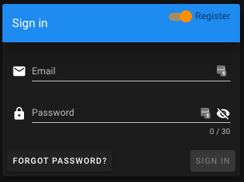
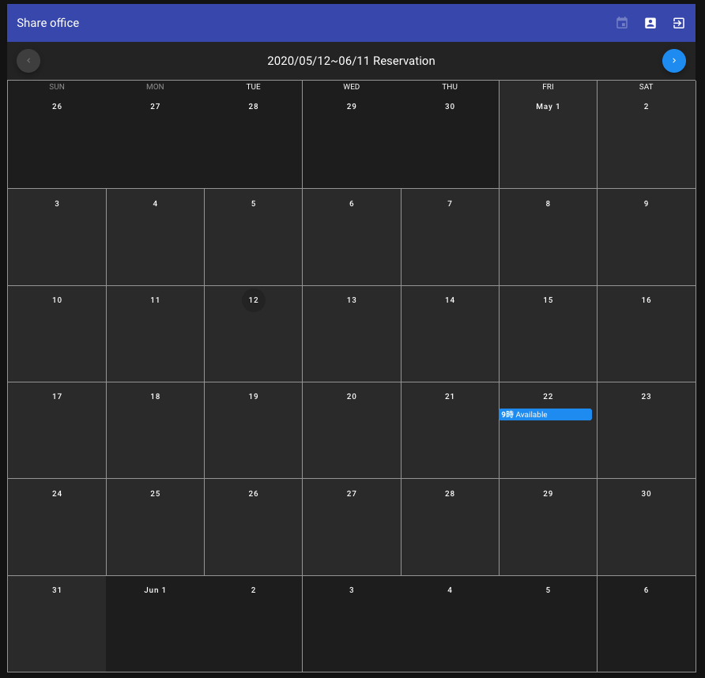
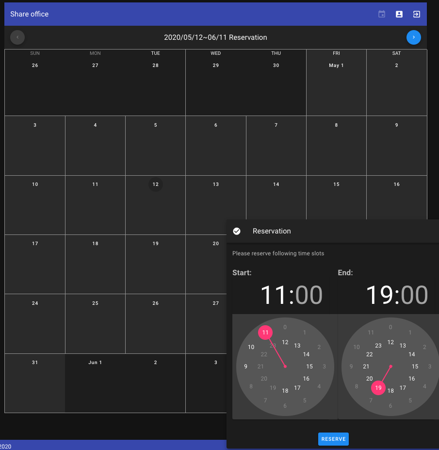
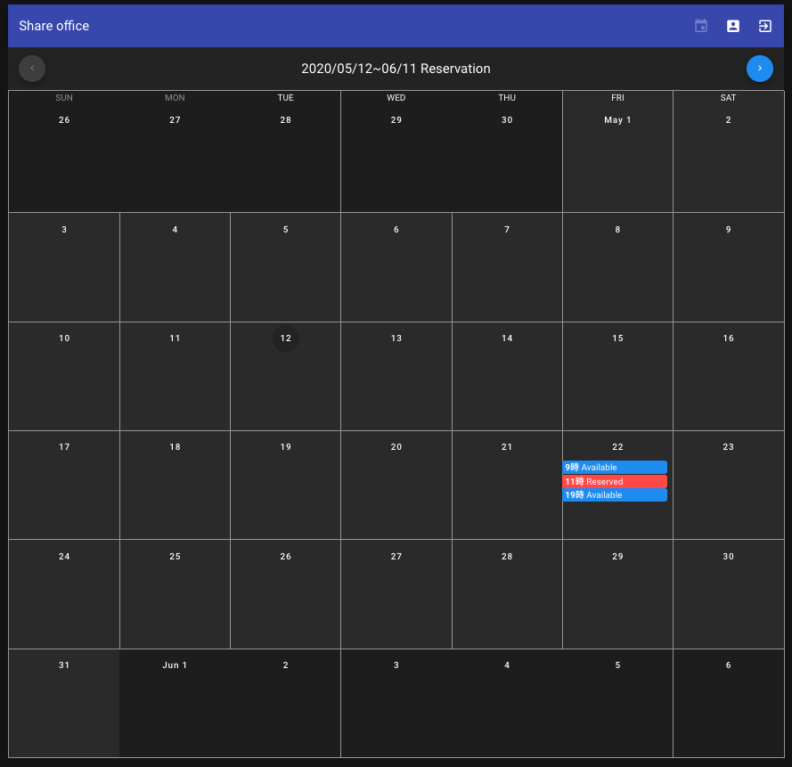
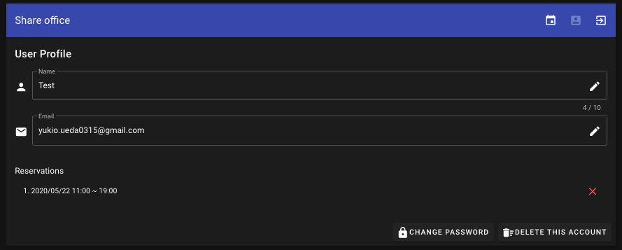
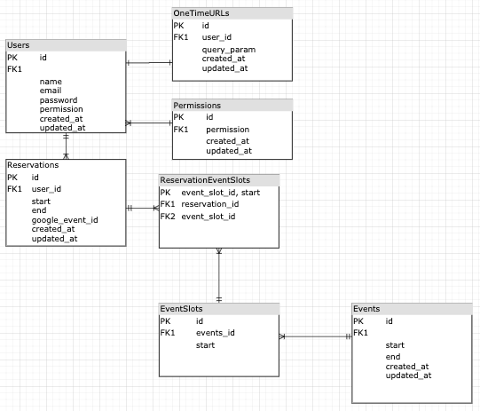

# reservation-frontend

This is a share space reservation system. Share space owner add available days in google calendar.
The system automatically fetch the data from google calendar. Then Users can reserve the available time slot.
When users add their reservation, the event automatically added on the google calendar.
This system needs signing in and it sends gmail confirmation.

## Demos







## Technologies

### Frontend

- TypeScript
- Vue.js
- Vuex
- Vue Property Decorator
- Vuetify
- Vue Router
- Vee Validate
- Moment.js
  and so on ...

### Backend

- Golang
- Gin
- gin-jwt
- Gorm
- MySQL

### Database structure

ER Diagram


## Project setup

```bash
yarn install
```

### Compiles and hot-reloads for development

```bash
yarn serve
```

### Compiles and minifies for production

```bash
yarn build
```

### Run your unit tests

```bash
yarn test:unit
```

### Lints and fixes files

```bash
yarn lint
```

### Customize configuration

See [Configuration Reference](https://cli.vuejs.org/config/).

## Author

- Yukio Ueda
- triangle.pillow@gmail.com

## License

[ISC](https://opensource.org/licenses/ISC)
